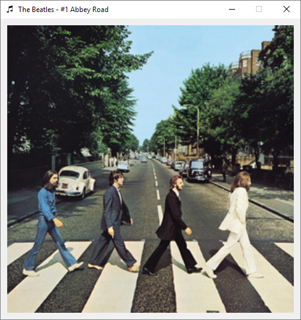

# albumen

A minimalist application that shows the top played albums of an artist.



## Usage
Create a `config.ini` file in the root folder (see [config.ini.sample](config.ini.sample)) and put there a valid [Last.fm API](https://www.last.fm/api) key.

Run the application with Python
```
python albumen.py
```
Use the key bindings:
* _Enter_: search an artist
* _Left/Right_Arrows_: show previus/next album
* _I_: open the album page on [Last.fm](https://www.last.fm) 
* _Esc_: exit

## Requirements
It runs on Python3.

It needs [pylast](https://github.com/pylast/pylast) and [PyQt5](https://pypi.org/project/PyQt5/).
